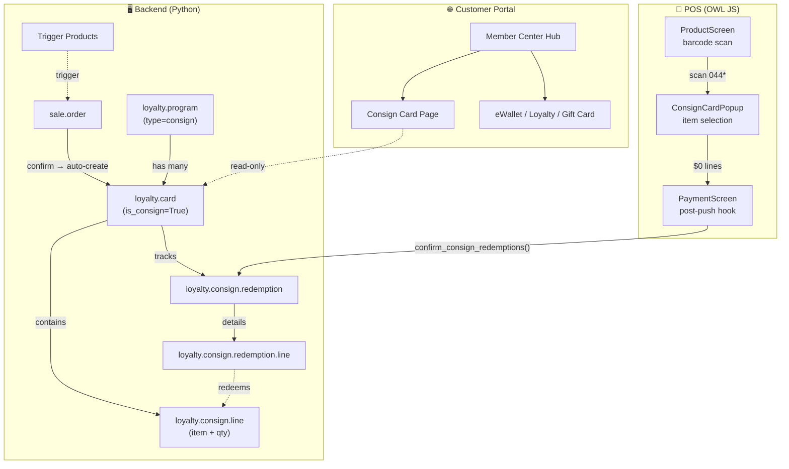
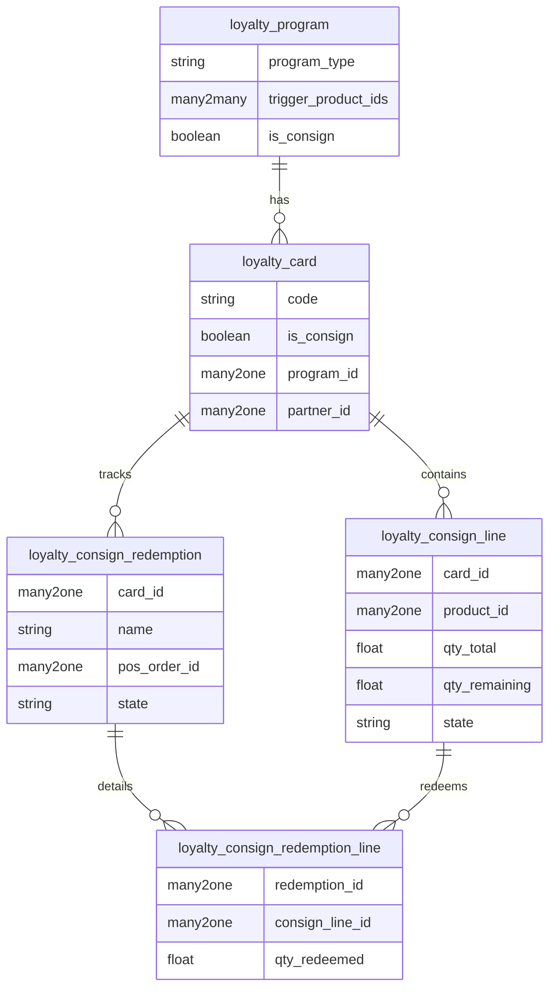
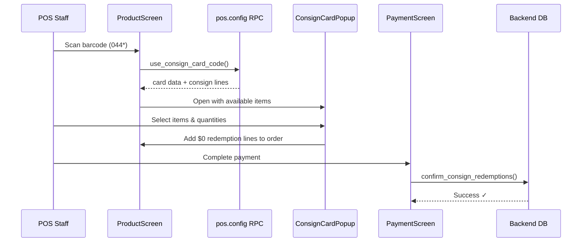
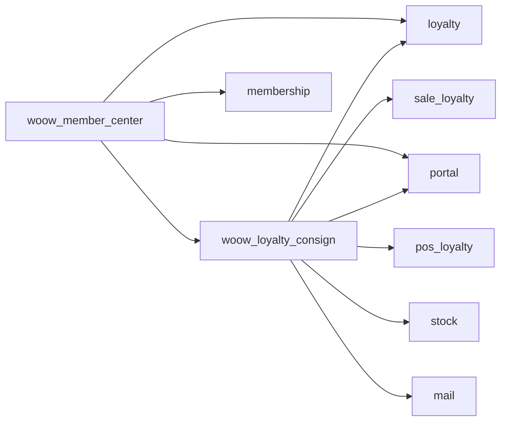

<p align="center">
  
</p>

<h1 align="center">Woow Odoo Loyalty Card Enhance</h1>

<p align="center">
  <a href="https://www.odoo.com"></a>
  <a href="LICENSE"></a>
  <a href="https://www.python.org"></a>
  <a href="https://www.woow.tw"></a>
</p>

<p align="center">
  <b>Consignment Card & Member Center — extending Odoo 18 Loyalty for wine cellars, med-spa prepaid treatments, and more.</b>
</p>

<p align="center">
  <a href="README_zh-TW.md">繁體中文</a> · English
</p>

---

## Table of Contents

[Overview](#overview) · [Modules](#modules) · [Architecture](#architecture) · [Features](#features) · [Screenshots](#screenshots) · [Installation](#installation) · [Configuration](#configuration) · [Usage](#usage) · [Technical Details](#technical-details) · [Roadmap](#roadmap) · [Contributing](#contributing) · [License](#license) · [Author](#author)

---

## Overview

| | |
|---|---|
| **Problem** | Odoo 18's built-in loyalty module supports points, eWallets, gift cards, and coupons — but lacks a mechanism for customers to **pre-purchase physical items** (wine bottles, spa sessions) and **redeem them later** one by one. |
| **Solution** | This add-on suite introduces a **Consignment Card** (`consign`) program type that tracks per-item quantities, supports POS barcode scanning for in-store redemption, and provides a unified **Member Center** portal for customers to check all their loyalty benefits. |

### Key Capabilities

- **Consignment Card** — Pre-purchase items, store them at the merchant, redeem individually via POS barcode scan or backend wizard
- **Automatic Card Creation** — Confirmed sale orders with trigger products automatically generate consignment cards
- **POS Integration** — Staff scans the card barcode → selects items → $0 redemption lines added to the order
- **Customer Portal** — Self-service card balance and redemption history
- **Member Center Hub** — Unified portal page aggregating eWallet, loyalty points, gift cards, coupons, membership, and consignment cards

---

## Modules

| Module | Summary | Dependencies |
|--------|---------|-------------|
| **`woow_loyalty_consign`** | Consignment card engine: program type, card model, consign lines, redemption records, POS integration, portal page, PDF report | `loyalty`, `sale_loyalty`, `pos_loyalty`, `stock`, `portal`, `mail` |
| **`woow_member_center`** | Unified member center portal hub aggregating all loyalty card types into a single responsive page | `portal`, `loyalty`, `membership`, `woow_loyalty_consign` |

---

## Architecture

### System Architecture



### Data Model



### POS Redemption Flow



---

## Features

### Consignment Card (`woow_loyalty_consign`)

- **New Program Type** — `consign` added to `loyalty.program` selection alongside existing types (loyalty, ewallet, gift_card, etc.)
- **Trigger Product Mechanism** — Link products to a consign program; when a sale order containing these products is confirmed, a consignment card is automatically created with per-item quantity lines
- **Consign Lines** — Track individual items with `qty_total`, `qty_remaining`, product reference, and state (`available` / `depleted`)
- **Backend Redemption Wizard** — Staff can redeem items via a wizard directly from the card form view
- **POS Barcode Integration** — Scan the card barcode at POS → popup shows available items → select quantities → $0 lines added to the POS order → redemption confirmed on payment
- **Redemption Records** — Full audit trail with sequence-numbered documents, linked to POS orders or manual operations
- **Customer Portal** — Card holders can view their cards, remaining items, and redemption history through the Odoo portal
- **PDF Report** — Printable card report with barcode, item list, and remaining quantities
- **Email Notification** — Automatic email sent to the customer when a consignment card is created

### Member Center (`woow_member_center`)

- **Unified Portal Hub** — Single responsive page aggregating all loyalty card types
- **Supported Card Types** — eWallet balance, loyalty points, gift cards, coupons, membership status, consignment cards
- **Mobile-First Design** — Responsive layout with SVG icons, optimized for both desktop and mobile
- **Deep Links** — Each card type links to its detailed page for full information

---

## Screenshots

### Backend Views

<p align="center">
  <br>
  <em>Consignment type in loyalty program type dropdown</em>
</p>

<p align="center">
  <br>
  <em>Consignment line form — tracking item quantities</em>
</p>

<p align="center">
  <br>
  <em>Backend menu structure — Consignment Cards under Sales</em>
</p>

<p align="center">
  <br>
  <em>Gift Card / eWallet program type dropdown (for comparison)</em>
</p>

### Portal / Member Center

<p align="center">
  <br>
  <em>Customer portal — consignment card detail with items and redemption history</em>
</p>

<p align="center">
  <br>
  <em>Member center hub (mobile) — all card types at a glance</em>
</p>

<p align="center">
  <br>
  <em>Portal home (mobile) with member center entry point</em>
</p>

<p align="center">
  <br>
  <em>Member center — eWallet balance detail</em>
</p>

<p align="center">
  <br>
  <em>Member center — loyalty points detail</em>
</p>

<p align="center">
  <br>
  <em>Member center — membership status</em>
</p>

---

## Installation

1. Clone this repository into your Odoo addons directory:
   ```bash
   cd /path/to/odoo/addons
   git clone https://github.com/WOOWTECH/Woow_odoo_loyalty_card_enhance.git
   ```

2. Add the repository path to your Odoo configuration:
   ```ini
   [options]
   addons_path = /path/to/odoo/addons,/path/to/Woow_odoo_loyalty_card_enhance
   ```

3. Restart Odoo and update the module list:
   ```bash
   odoo -u base --stop-after-init
   ```

4. Install modules from the Odoo Apps menu:
   - Search for **"寄品卡"** or **"Consignment Card"** → Install `woow_loyalty_consign`
   - Search for **"會員中心"** or **"Member Center"** → Install `woow_member_center`

### Prerequisites

| Requirement | Version |
|-------------|---------|
| Odoo | 18.0 (Community or Enterprise) |
| Python | 3.12+ |
| Required Odoo modules | `loyalty`, `sale_loyalty`, `pos_loyalty`, `stock`, `portal`, `mail`, `membership` |

---

## Configuration

### 1. Create a Consign Program

1. Navigate to **Sales → Products → Loyalty Cards & Gift Cards**
2. Click **New** and select program type **Consignment Card (寄品卡)**
3. In the **Trigger Products** tab, add the products that should generate consignment cards when sold
4. Configure email template and card validity as needed

### 2. POS Setup

1. The POS barcode rules (prefix `044`) are automatically configured
2. Ensure the **Consignment Redemption Product** (auto-created data record) is available in your POS product list
3. POS users need the **Point of Sale / User** group (ACLs are pre-configured)

### 3. Portal Access

- Portal users automatically see their consignment cards under **My Account → Consignment Cards**
- Install `woow_member_center` for the unified member center hub

---

## Usage

### Create a Consign Program

1. Go to **Sales → Products → Loyalty Cards & Gift Cards**
2. Create a new program with type **Consignment Card**
3. Add trigger products (e.g., "Wine Case — 6 bottles")

### Sale Order → Auto Card Creation

1. Create a sale order with trigger products
2. Confirm the sale order
3. A consignment card is automatically created with individual item lines
4. Customer receives an email notification with their card details

### POS Barcode Redemption

1. At the POS, scan the customer's consignment card barcode
2. A popup displays available items with remaining quantities
3. Select items and quantities to redeem
4. Confirm — $0 redemption lines are added to the order
5. Complete payment — redemption is recorded in the backend

### Customer Portal

1. Customer logs into the Odoo portal
2. Navigates to **My Account → Consignment Cards** (or **Member Center**)
3. Views card balance, item list, and redemption history

---

## Technical Details

### Module Dependencies



### File Structure

```
Woow_odoo_loyalty_card_enhance/
├── woow_loyalty_consign/
│   ├── __manifest__.py
│   ├── __init__.py
│   ├── models/
│   │   ├── loyalty_program.py          # consign program type
│   │   ├── loyalty_card.py             # card extension
│   │   ├── loyalty_consign_line.py     # per-item tracking
│   │   ├── loyalty_consign_redemption.py  # redemption documents
│   │   ├── sale_order.py               # auto card creation
│   │   ├── pos_config.py              # POS barcode RPC
│   │   ├── pos_order.py              # POS redemption confirmation
│   │   └── pos_order_line.py         # POS line extension
│   ├── wizard/
│   │   └── consign_redeem_wizard.py   # backend redemption wizard
│   ├── controllers/
│   │   └── portal.py                 # customer portal controllers
│   ├── views/                        # XML views, menus, portal templates
│   ├── security/                     # ACLs and record rules
│   ├── data/                         # sequences, email templates, products
│   ├── report/                       # PDF report templates
│   └── static/src/                   # POS OWL components (JS/XML)
│       └── overrides/
│           ├── components/
│           │   ├── product_screen/    # barcode scan handler
│           │   ├── payment_screen/    # post-payment hook
│           │   └── consign_card_popup/ # item selection popup
│           └── models/
│               └── pos_order.js       # order sync extension
├── woow_member_center/
│   ├── __manifest__.py
│   ├── models/
│   ├── controllers/
│   ├── views/                        # portal hub templates
│   ├── security/
│   └── static/src/css/              # responsive styles
├── docs/
│   ├── images/                       # screenshots
│   └── ARCHITECTURE.md               # detailed architecture docs
├── README.md                         # English documentation
├── README_zh-TW.md                   # 繁體中文文件
├── LICENSE                           # LGPL-3
└── CHANGELOG.md                      # version history
```

### Security & Access Control

| Model | Salesman | Manager | POS User | Portal |
|-------|----------|---------|----------|--------|
| `loyalty.consign.line` | CRUD (no delete) | Full CRUD | Read only | Read only |
| `loyalty.consign.redemption` | CRUD (no delete) | Full CRUD | Read + Create | Read only |
| `loyalty.consign.redemption.line` | CRUD (no delete) | Full CRUD | Read + Create | Read only |
| `loyalty.card` | (inherited) | (inherited) | (inherited) | Read only |

Portal users can only see their own records (row-level security via `ir.rule`).

---

## Roadmap

- [ ] Batch redemption — redeem from multiple cards in one POS transaction
- [ ] Expiration management — auto-notify when card items are nearing expiry
- [ ] Transfer — allow customers to transfer consigned items to another member
- [ ] Inventory integration — link consignment lines to warehouse stock moves
- [ ] Analytics dashboard — redemption trends, popular items, card utilization rates

---

## Contributing

Contributions are welcome! Please follow these steps:

1. Fork the repository
2. Create a feature branch (`git checkout -b feature/my-feature`)
3. Commit your changes (`git commit -m 'feat: add my feature'`)
4. Push to the branch (`git push origin feature/my-feature`)
5. Open a Pull Request

Please ensure your code follows the [Odoo coding guidelines](https://www.odoo.com/documentation/18.0/contributing/development/coding_guidelines.html).

---

## License

This project is licensed under the **GNU Lesser General Public License v3.0 (LGPL-3)** — see the [LICENSE](LICENSE) file for details.

---

## Author

<p align="center">
  <b>WoowTech 沃科技</b><br>
  <a href="https://www.woow.tw">https://www.woow.tw</a><br>
  Odoo integration specialists — ERP, loyalty, POS, and e-commerce solutions
</p>
