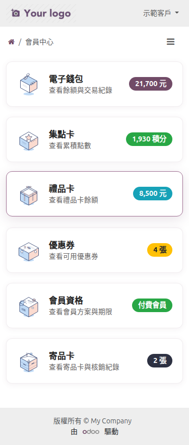
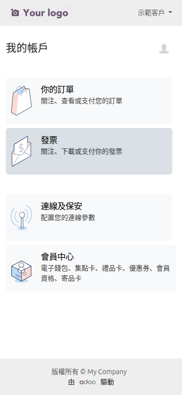
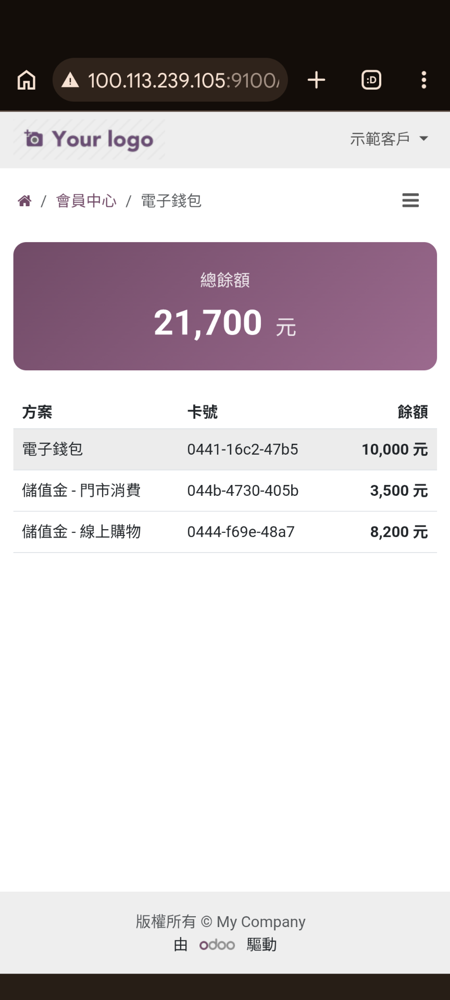
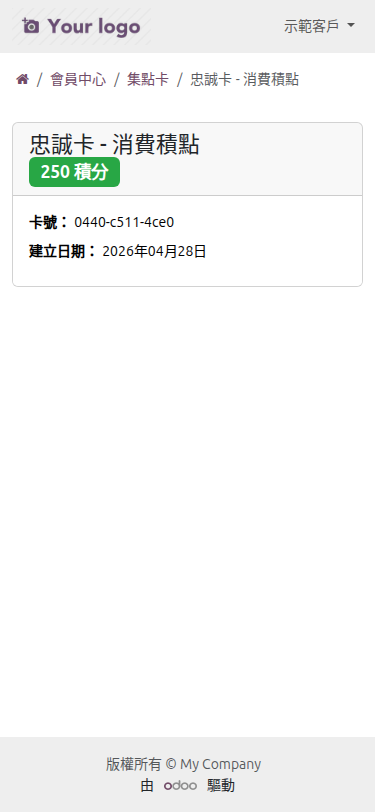
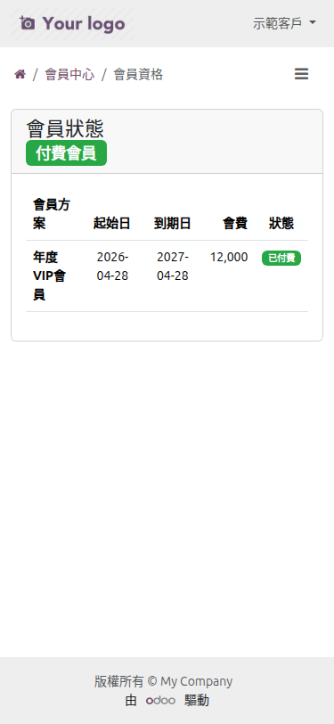
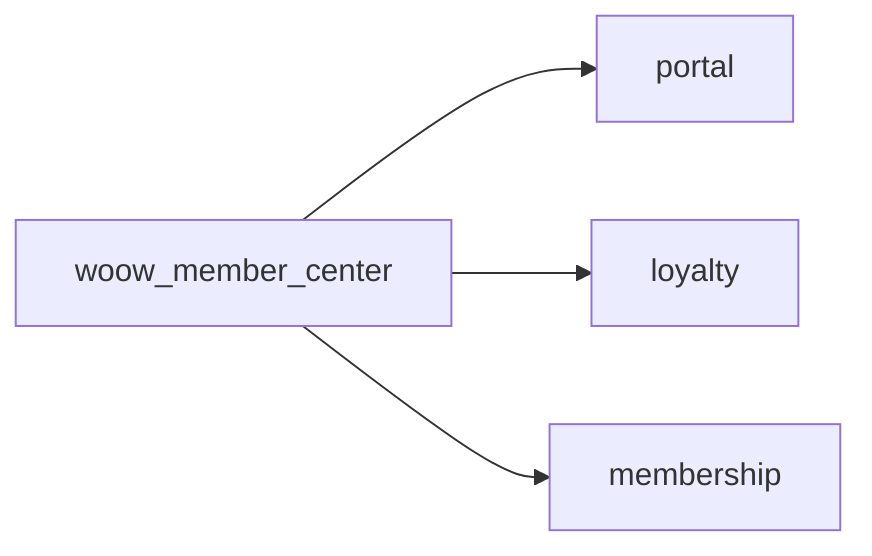

<p align="center">
  
</p>

<h1 align="center">Woow Odoo Member Center</h1>

<p align="center">
  <a href="https://www.odoo.com"></a>
  <a href="LICENSE"></a>
  <a href="https://www.python.org"></a>
  <a href="https://www.woow.tw"></a>
</p>

<p align="center">
  <b>Unified Member Center Portal — extending Odoo 18 Loyalty with a single hub for eWallet, loyalty points, gift cards, coupons, and membership.</b>
</p>

<p align="center">
  <a href="README_zh-TW.md">繁體中文</a> · English
</p>

---

## Table of Contents

[Overview](#overview) · [Features](#features) · [Screenshots](#screenshots) · [Installation](#installation) · [Configuration](#configuration) · [Usage](#usage) · [Technical Details](#technical-details) · [Roadmap](#roadmap) · [Contributing](#contributing) · [License](#license) · [Author](#author)

---

## Overview

| | |
|---|---|
| **Problem** | Odoo 18's portal scatters loyalty-related information across separate pages — customers must navigate individually to check their eWallet balance, loyalty points, gift cards, coupons, and membership status. |
| **Solution** | This module provides a **unified Member Center** portal hub that aggregates all loyalty card types and membership status into a single responsive page with quick-glance metrics. |

### Key Capabilities

- **Unified Portal Hub** — Single page aggregating eWallet, loyalty points, gift cards, coupons, and membership
- **Quick-Glance Metrics** — Balances, point totals, coupon counts, and membership status displayed at a glance
- **Mobile-First Design** — Responsive layout with SVG icons, optimized for both desktop and mobile
- **Deep Links** — Each card type links to its detailed page for full information

---

## Features

### Member Center (`woow_member_center`)

- **Unified Portal Hub** — Single responsive page aggregating all loyalty card types
- **Supported Card Types**:
  - **eWallet** — Balance display with currency formatting
  - **Loyalty Points** — Accumulated points with custom point names
  - **Gift Cards** — Balance display with currency formatting
  - **Coupons** — Available coupon count
  - **Membership** — Current membership status and state
- **Individual Detail Pages** — Each card type has list and detail views
- **Portal Home Integration** — Member Center entry point added to the main portal home page
- **Breadcrumb Navigation** — Full breadcrumb support for all sub-pages
- **Mobile-First Design** — Responsive card grid layout with SVG icons

---

## Screenshots

### Portal / Member Center

<p align="center">
  <br>
  <em>Member center hub (mobile) — all card types at a glance</em>
</p>

<p align="center">
  <br>
  <em>Portal home (mobile) with member center entry point</em>
</p>

<p align="center">
  <br>
  <em>Member center — eWallet balance detail</em>
</p>

<p align="center">
  <br>
  <em>Member center — loyalty points detail</em>
</p>

<p align="center">
  <br>
  <em>Member center — membership status</em>
</p>

---

## Installation

1. Clone this repository into your Odoo addons directory:
   ```bash
   cd /path/to/odoo/addons
   git clone https://github.com/WOOWTECH/Woow_odoo_loyalty_card_enhance.git
   ```

2. Add the repository path to your Odoo configuration:
   ```ini
   [options]
   addons_path = /path/to/odoo/addons,/path/to/Woow_odoo_loyalty_card_enhance
   ```

3. Restart Odoo and update the module list:
   ```bash
   odoo -u base --stop-after-init
   ```

4. Install the module from the Odoo Apps menu:
   - Search for **"會員中心"** or **"Member Center"** → Install `woow_member_center`

### Prerequisites

| Requirement | Version |
|-------------|---------|
| Odoo | 18.0 (Community or Enterprise) |
| Python | 3.12+ |
| Required Odoo modules | `loyalty`, `portal`, `membership` |

---

## Configuration

No special configuration is needed. Once installed, the Member Center portal hub is automatically available to all portal users.

### Portal Access

- Portal users will see a **Member Center** entry on their portal home page
- Clicking it opens the unified hub page with all their loyalty card types
- Each card type links to its detailed page

---

## Usage

### Customer Portal

1. Customer logs into the Odoo portal
2. Clicks **Member Center** on the portal home page
3. Views all loyalty card types at a glance:
   - eWallet balance
   - Loyalty points
   - Gift card balance
   - Available coupons
   - Membership status
4. Clicks any card to see detailed information

---

## Technical Details

### Module Dependencies



### File Structure

```
Woow_odoo_loyalty_card_enhance/
├── woow_member_center/
│   ├── __manifest__.py
│   ├── __init__.py
│   ├── controllers/
│   │   └── portal.py                 # Portal controllers
│   ├── views/
│   │   ├── portal_templates.xml      # Hub page & portal home entry
│   │   ├── ewallet_templates.xml     # eWallet pages
│   │   ├── loyalty_templates.xml     # Loyalty points pages
│   │   ├── gift_card_templates.xml   # Gift card pages
│   │   ├── coupon_templates.xml      # Coupon pages
│   │   └── membership_templates.xml  # Membership page
│   ├── security/
│   │   ├── ir.model.access.csv
│   │   └── portal_security.xml
│   └── static/
│       ├── description/
│       │   └── icon.png
│       └── src/
│           ├── css/
│           │   └── member_center.css  # Responsive styles
│           └── img/                   # SVG icons
├── docs/
│   ├── images/                        # Screenshots
│   └── ARCHITECTURE.md                # Architecture docs
├── README.md                          # English documentation
├── README_zh-TW.md                    # 繁體中文文件
├── LICENSE                            # LGPL-3
└── CHANGELOG.md                       # Version history
```

### Portal Routes

| Route | Description |
|-------|-------------|
| `/my/member-center` | Main hub page with all card types |
| `/my/member-center/ewallet` | eWallet list |
| `/my/member-center/ewallet/<id>` | eWallet detail |
| `/my/member-center/loyalty` | Loyalty points list |
| `/my/member-center/loyalty/<id>` | Loyalty points detail |
| `/my/member-center/gift-cards` | Gift card list |
| `/my/member-center/gift-cards/<id>` | Gift card detail |
| `/my/member-center/coupons` | Coupon list |
| `/my/member-center/coupons/<id>` | Coupon detail |
| `/my/member-center/membership` | Membership status |

---

## Roadmap

- [ ] Transaction history — show recent point/balance changes on detail pages
- [ ] Card sharing — allow customers to share gift cards with others
- [ ] Notifications — alert customers of expiring coupons or low balances
- [ ] Dashboard widgets — add member center summary to the main portal dashboard

---

## Contributing

Contributions are welcome! Please follow these steps:

1. Fork the repository
2. Create a feature branch (`git checkout -b feature/my-feature`)
3. Commit your changes (`git commit -m 'feat: add my feature'`)
4. Push to the branch (`git push origin feature/my-feature`)
5. Open a Pull Request

Please ensure your code follows the [Odoo coding guidelines](https://www.odoo.com/documentation/18.0/contributing/development/coding_guidelines.html).

---

## License

This project is licensed under the **GNU Lesser General Public License v3.0 (LGPL-3)** — see the [LICENSE](LICENSE) file for details.

---

## Author

<p align="center">
  <b>WoowTech 沃科技</b><br>
  <a href="https://www.woow.tw">https://www.woow.tw</a><br>
  Odoo integration specialists — ERP, loyalty, POS, and e-commerce solutions
</p>
