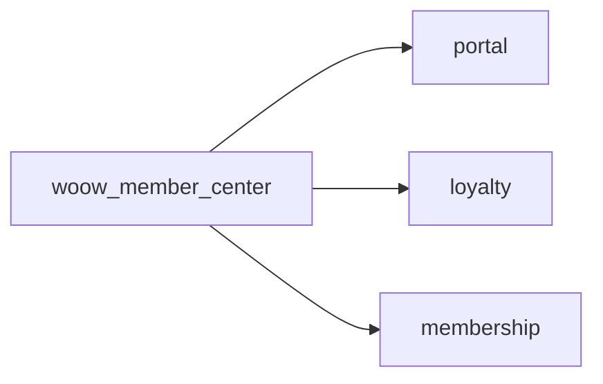

<p align="center">
  
</p>

<h1 align="center">Woow Odoo 會員中心</h1>

<p align="center">
  <a href="https://www.odoo.com"></a>
  <a href="LICENSE"></a>
  <a href="https://www.python.org"></a>
  <a href="https://www.woow.tw"></a>
</p>

<p align="center">
  <b>統一會員中心入口 — 擴展 Odoo 18 忠誠度模組，整合電子錢包、集點卡、禮品卡、優惠券、會員資格於單一頁面。</b>
</p>

<p align="center">
  <a href="README.md">English</a> · 繁體中文
</p>

---

## 目錄

[概述](#概述) · [功能特色](#功能特色) · [畫面截圖](#畫面截圖) · [安裝](#安裝) · [設定](#設定) · [使用方式](#使用方式) · [技術細節](#技術細節) · [開發藍圖](#開發藍圖) · [貢獻](#貢獻) · [授權](#授權) · [作者](#作者)

---

## 概述

| | |
|---|---|
| **痛點** | Odoo 18 的入口網站將忠誠度相關資訊散落在不同頁面——顧客必須逐一瀏覽才能查看電子錢包餘額、集點、禮品卡、優惠券及會員資格。 |
| **解決方案** | 本模組提供統一的**會員中心**入口頁面，將所有忠誠卡類型與會員資格匯整至單一響應式頁面，搭配即時摘要指標。 |

### 核心能力

- **統一入口** — 單一頁面匯整電子錢包、集點卡、禮品卡、優惠券、會員資格
- **即時摘要** — 餘額、點數、優惠券數量、會員狀態一目了然
- **行動優先設計** — 響應式排版搭配 SVG 圖示，桌面與手機均最佳化
- **深層連結** — 每種卡類型連結至詳細頁面查看完整資訊

---

## 功能特色

### 會員中心（`woow_member_center`）

- **統一入口頁面** — 單一響應式頁面匯整所有忠誠卡類型
- **支援卡種**：
  - **電子錢包** — 餘額顯示，含貨幣格式
  - **集點卡** — 累積點數，含自訂點數名稱
  - **禮品卡** — 餘額顯示，含貨幣格式
  - **優惠券** — 可用券數量
  - **會員資格** — 當前會員狀態
- **個別詳細頁面** — 每種卡類型皆有清單與詳情視圖
- **入口首頁整合** — 會員中心入口自動加入主要入口首頁
- **麵包屑導航** — 所有子頁面皆有完整麵包屑支援
- **行動優先設計** — 響應式卡片網格排版搭配 SVG 圖示

---

## 畫面截圖

### 入口 / 會員中心

<p align="center">
  <br>
  <em>會員中心總覽（手機版）——一覽所有卡種</em>
</p>

<p align="center">
  <br>
  <em>入口首頁（手機版）含會員中心入口</em>
</p>

<p align="center">
  <br>
  <em>會員中心——電子錢包餘額明細</em>
</p>

<p align="center">
  <br>
  <em>會員中心——集點卡點數明細</em>
</p>

<p align="center">
  <br>
  <em>會員中心——會員資格狀態</em>
</p>

---

## 安裝

1. 將本倉庫 clone 至您的 Odoo addons 目錄：
   ```bash
   cd /path/to/odoo/addons
   git clone https://github.com/WOOWTECH/Woow_odoo_loyalty_card_enhance.git
   ```

2. 在 Odoo 設定檔中加入倉庫路徑：
   ```ini
   [options]
   addons_path = /path/to/odoo/addons,/path/to/Woow_odoo_loyalty_card_enhance
   ```

3. 重啟 Odoo 並更新模組清單：
   ```bash
   odoo -u base --stop-after-init
   ```

4. 從 Odoo 應用程式選單安裝模組：
   - 搜尋 **「會員中心」** 或 **「Member Center」** → 安裝 `woow_member_center`

### 系統需求

| 需求 | 版本 |
|------|------|
| Odoo | 18.0（社區版或企業版） |
| Python | 3.12+ |
| 必要 Odoo 模組 | `loyalty`, `portal`, `membership` |

---

## 設定

安裝完成後無需特別設定。會員中心入口自動對所有入口使用者開放。

### 入口網站存取

- 入口使用者在首頁自動看到**會員中心**入口
- 點擊後開啟統一的匯整頁面，顯示所有忠誠卡類型
- 每種卡類型可連結至詳細頁面

---

## 使用方式

### 顧客入口

1. 顧客登入 Odoo 入口網站
2. 點擊首頁的**會員中心**
3. 一覽所有忠誠卡類型：
   - 電子錢包餘額
   - 集點卡點數
   - 禮品卡餘額
   - 可用優惠券
   - 會員資格狀態
4. 點擊任一卡種查看詳細資訊

---

## 技術細節

### 模組相依圖



### 檔案結構

```
Woow_odoo_loyalty_card_enhance/
├── woow_member_center/
│   ├── __manifest__.py
│   ├── __init__.py
│   ├── controllers/
│   │   └── portal.py                 # 入口控制器
│   ├── views/
│   │   ├── portal_templates.xml      # 匯整頁面與入口首頁入口
│   │   ├── ewallet_templates.xml     # 電子錢包頁面
│   │   ├── loyalty_templates.xml     # 集點卡頁面
│   │   ├── gift_card_templates.xml   # 禮品卡頁面
│   │   ├── coupon_templates.xml      # 優惠券頁面
│   │   └── membership_templates.xml  # 會員資格頁面
│   ├── security/
│   │   ├── ir.model.access.csv
│   │   └── portal_security.xml
│   └── static/
│       ├── description/
│       │   └── icon.png
│       └── src/
│           ├── css/
│           │   └── member_center.css  # 響應式樣式
│           └── img/                   # SVG 圖示
├── docs/
│   ├── images/                        # 畫面截圖
│   └── ARCHITECTURE.md                # 架構文件
├── README.md                          # 英文文件
├── README_zh-TW.md                    # 繁體中文文件
├── LICENSE                            # LGPL-3
└── CHANGELOG.md                       # 版本紀錄
```

### 入口路由

| 路由 | 說明 |
|------|------|
| `/my/member-center` | 主匯整頁面，含所有卡種 |
| `/my/member-center/ewallet` | 電子錢包清單 |
| `/my/member-center/ewallet/<id>` | 電子錢包明細 |
| `/my/member-center/loyalty` | 集點卡清單 |
| `/my/member-center/loyalty/<id>` | 集點卡明細 |
| `/my/member-center/gift-cards` | 禮品卡清單 |
| `/my/member-center/gift-cards/<id>` | 禮品卡明細 |
| `/my/member-center/coupons` | 優惠券清單 |
| `/my/member-center/coupons/<id>` | 優惠券明細 |
| `/my/member-center/membership` | 會員資格狀態 |

---

## 開發藍圖

- [ ] 交易紀錄——在詳細頁面顯示近期點數／餘額變動
- [ ] 卡片分享——允許顧客將禮品卡分享給他人
- [ ] 通知——優惠券即將到期或餘額不足時提醒顧客
- [ ] 儀表板小工具——在主入口儀表板加入會員中心摘要

---

## 貢獻

歡迎貢獻！請依以下步驟：

1. Fork 本倉庫
2. 建立功能分支（`git checkout -b feature/my-feature`）
3. 提交變更（`git commit -m 'feat: add my feature'`）
4. 推送分支（`git push origin feature/my-feature`）
5. 建立 Pull Request

請確保您的程式碼遵循 [Odoo 開發指南](https://www.odoo.com/documentation/18.0/contributing/development/coding_guidelines.html)。

---

## 授權

本專案採用 **GNU 較寬鬆通用公共授權 v3.0 (LGPL-3)** 授權——詳見 [LICENSE](LICENSE) 檔案。

---

## 作者

<p align="center">
  <b>WoowTech 沃科技</b><br>
  <a href="https://www.woow.tw">https://www.woow.tw</a><br>
  Odoo 整合專家——ERP、忠誠度、POS 與電子商務解決方案
</p>
