<p align="center">
  
</p>

<h1 align="center">Woow Odoo 忠誠卡增強套件</h1>

<p align="center">
  <a href="https://www.odoo.com"></a>
  <a href="LICENSE"></a>
  <a href="https://www.python.org"></a>
  <a href="https://www.woow.tw"></a>
</p>

<p align="center">
  <b>寄品卡 & 會員中心 — 擴展 Odoo 18 忠誠度模組，支援酒窖寄存、醫美療程預購等場景。</b>
</p>

<p align="center">
  <a href="README.md">English</a> · 繁體中文
</p>

---

## 目錄

[概述](#概述) · [模組](#模組) · [架構](#架構) · [功能特色](#功能特色) · [畫面截圖](#畫面截圖) · [安裝](#安裝) · [設定](#設定) · [使用方式](#使用方式) · [技術細節](#技術細節) · [開發藍圖](#開發藍圖) · [貢獻](#貢獻) · [授權](#授權) · [作者](#作者)

---

## 概述

| | |
|---|---|
| **痛點** | Odoo 18 內建忠誠度模組支援集點、電子錢包、禮品卡、優惠券——但缺少讓顧客**預購實體商品**（紅酒、SPA 療程）並**逐次取用核銷**的機制。 |
| **解決方案** | 本套件新增**寄品卡**（`consign`）計劃類型，追蹤逐品項的數量，支援 POS 掃碼核銷，並提供統一的**會員中心**入口讓顧客查閱所有忠誠度權益。 |

### 核心能力

- **寄品卡** — 顧客預購商品寄存於店家，透過 POS 掃碼或後台精靈逐次核銷取用
- **自動建卡** — 銷售訂單確認時，含有觸發商品的訂單自動產生寄品卡
- **POS 整合** — 店員掃描卡片條碼 → 選擇品項 → $0 核銷行加入訂單
- **顧客入口** — 自助查看卡片餘額與核銷紀錄
- **會員中心** — 統一入口頁面匯整電子錢包、集點卡、禮品卡、優惠券、會員資格、寄品卡

---

## 模組

| 模組 | 說明 | 相依模組 |
|------|------|---------|
| **`woow_loyalty_consign`** | 寄品卡引擎：計劃類型、卡片模型、寄品明細、核銷紀錄、POS 整合、入口網站頁面、PDF 報表 | `loyalty`, `sale_loyalty`, `pos_loyalty`, `stock`, `portal`, `mail` |
| **`woow_member_center`** | 統一會員中心入口，匯整所有忠誠卡類型於單一響應式頁面 | `portal`, `loyalty`, `membership`, `woow_loyalty_consign` |

---

## 架構

### 系統架構圖

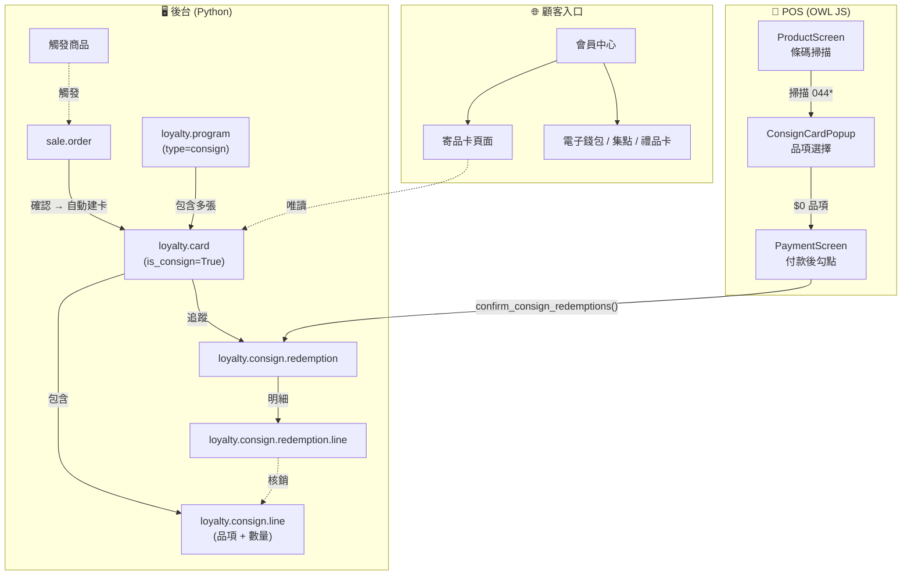

### 資料模型

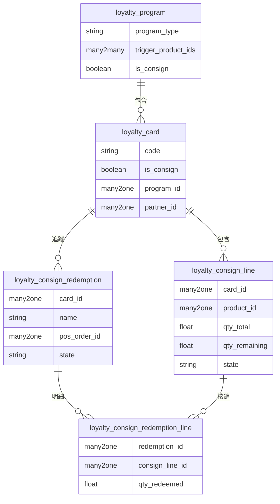

### POS 核銷流程

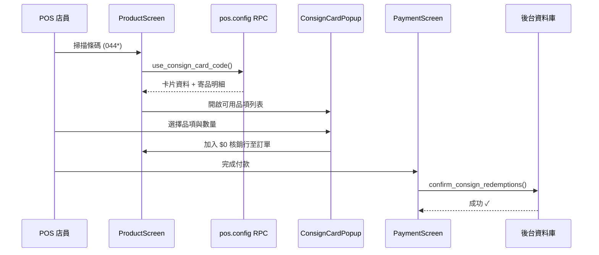

---

## 功能特色

### 寄品卡（`woow_loyalty_consign`）

- **新計劃類型** — 在 `loyalty.program` 的類型選項中新增 `consign`（寄品卡），與現有的集點、電子錢包、禮品卡並列
- **觸發商品機制** — 將商品連結至寄品計劃；當包含觸發商品的銷售訂單確認時，自動產生寄品卡及逐品項數量明細
- **寄品明細** — 追蹤每個品項的 `qty_total`（總數量）、`qty_remaining`（剩餘數量）、商品參照及狀態（`available` / `depleted`）
- **後台核銷精靈** — 店員可從卡片表單直接執行核銷精靈進行扣品
- **POS 條碼整合** — 掃描卡片條碼 → 彈窗顯示可用品項 → 選擇數量 → $0 核銷行加入 POS 訂單 → 付款時確認核銷
- **核銷紀錄** — 完整稽核軌跡，含序號編號文件，關聯 POS 訂單或手動操作
- **顧客入口** — 持卡人可透過 Odoo 入口網站查看卡片、剩餘品項及核銷歷史
- **PDF 報表** — 含條碼、品項清單及剩餘數量的可列印卡片報表
- **電子郵件通知** — 寄品卡建立時自動發送通知郵件給顧客

### 會員中心（`woow_member_center`）

- **統一入口** — 單一響應式頁面匯整所有忠誠卡類型
- **支援卡種** — 電子錢包餘額、集點點數、禮品卡、優惠券、會員資格、寄品卡
- **行動優先設計** — 響應式排版搭配 SVG 圖示，桌面與手機均最佳化
- **深層連結** — 每種卡類型連結至詳細頁面查看完整資訊

---

## 畫面截圖

### 後台畫面

<p align="center">
  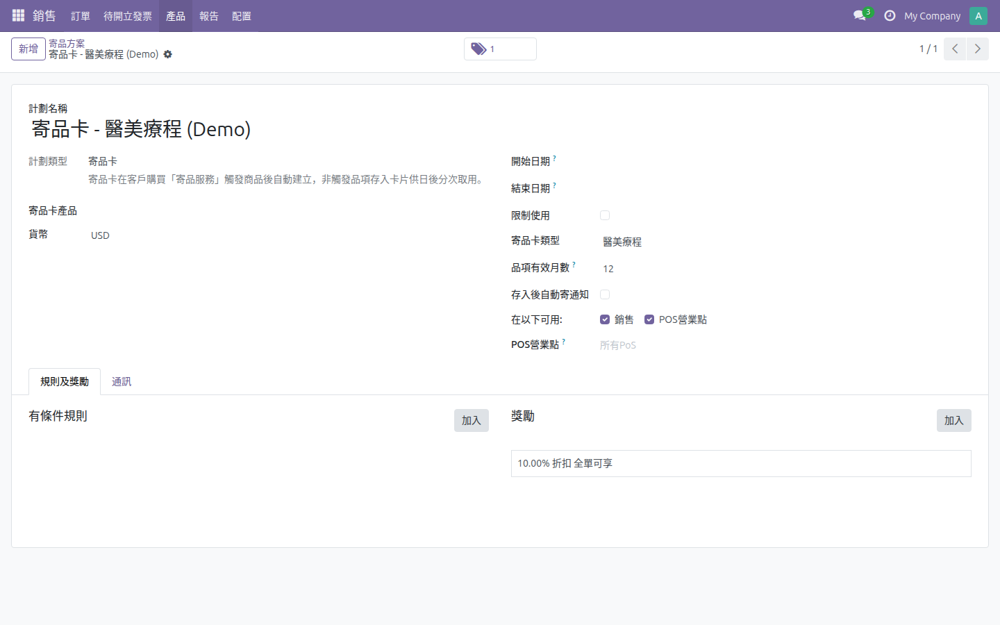<br>
  <em>寄品計劃表單——觸發商品與設定</em>
</p>

<p align="center">
  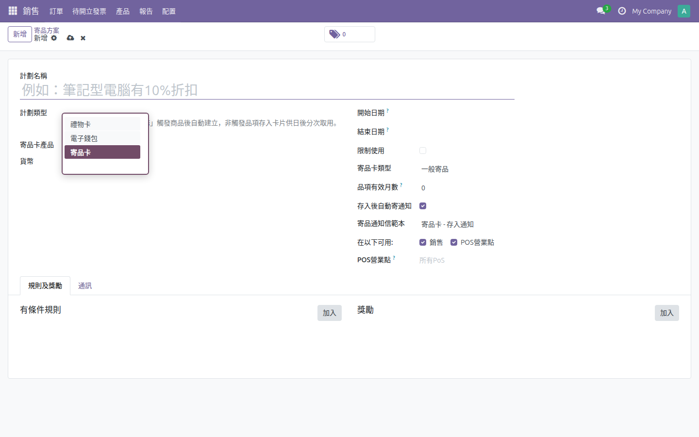<br>
  <em>忠誠計劃類型下拉選單中的寄品卡選項</em>
</p>

<p align="center">
  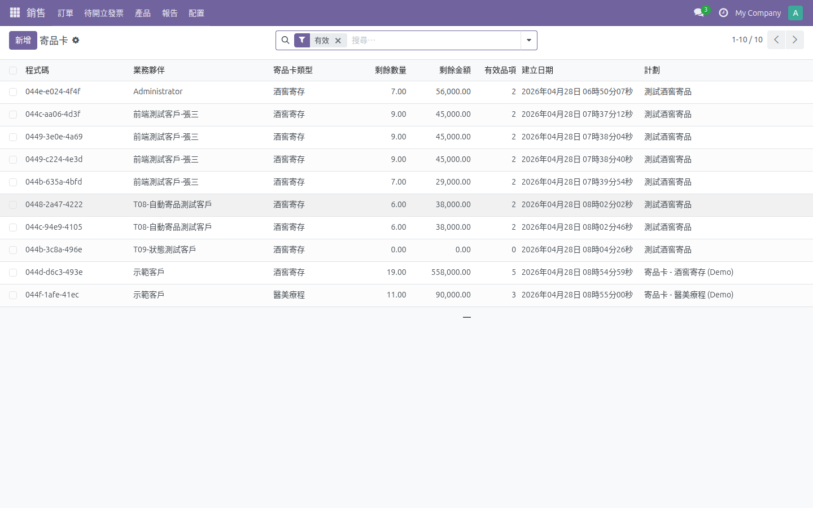<br>
  <em>寄品卡列表視圖——所有卡片狀態概覽</em>
</p>

<p align="center">
  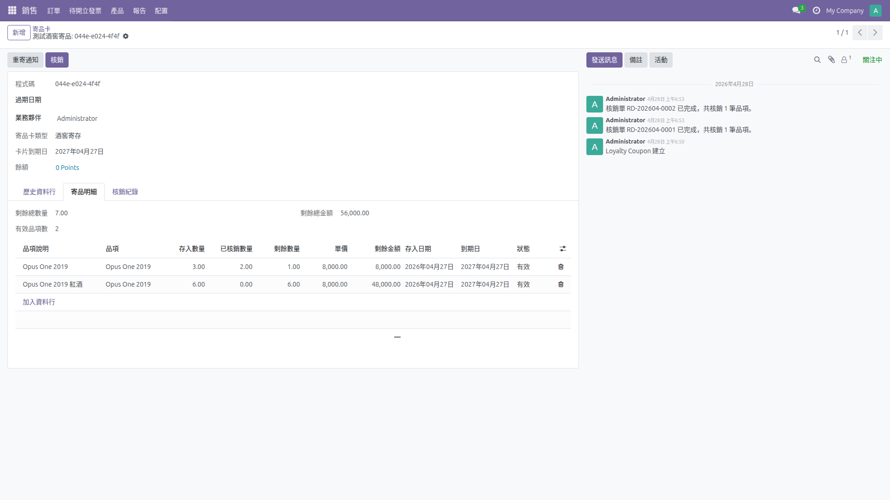<br>
  <em>寄品卡表單——品項、數量及卡片詳情</em>
</p>

<p align="center">
  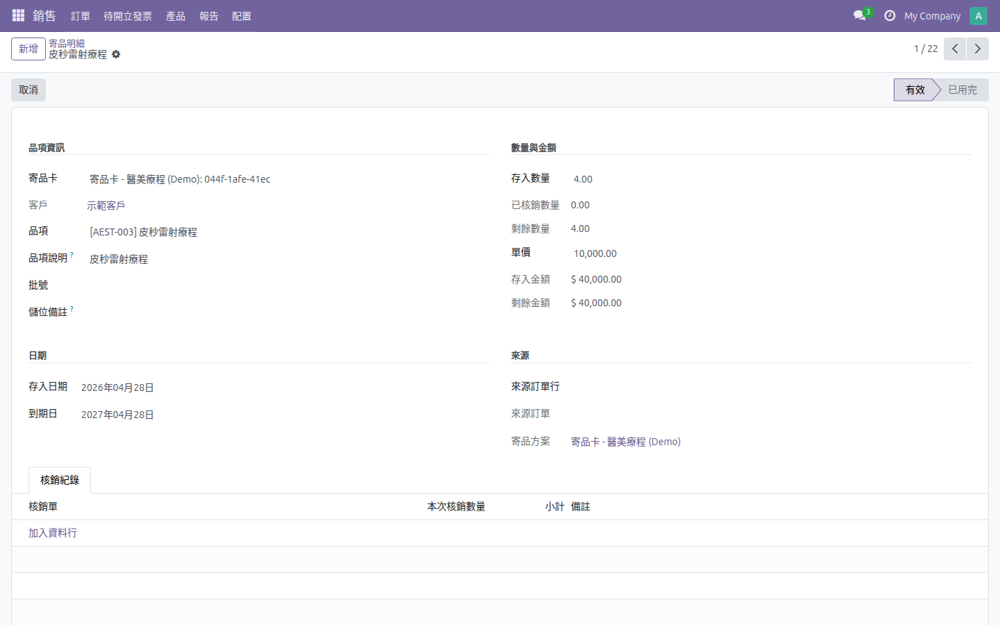<br>
  <em>寄品明細表單——追蹤品項數量</em>
</p>

<p align="center">
  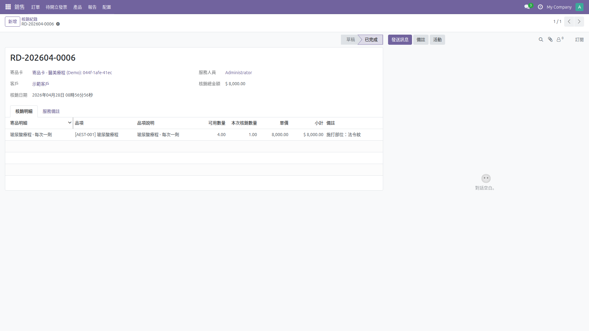<br>
  <em>核銷紀錄——已核銷品項的稽核軌跡</em>
</p>

<p align="center">
  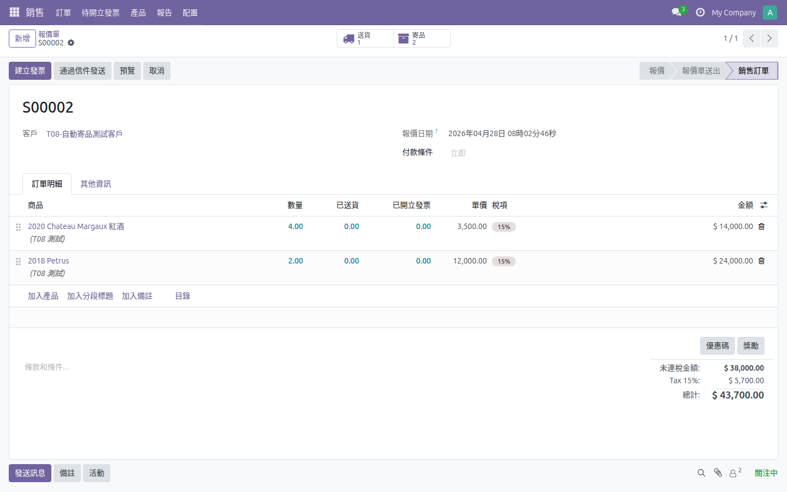<br>
  <em>含寄品卡指示器的銷售訂單</em>
</p>

<p align="center">
  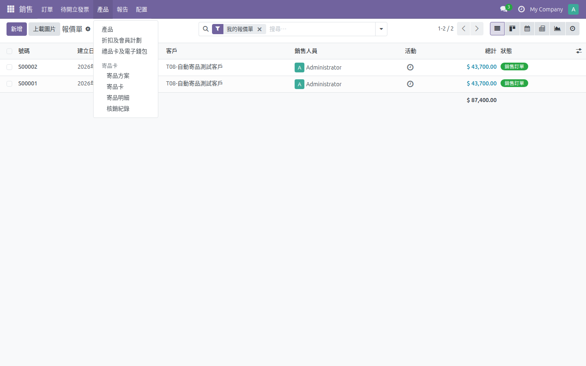<br>
  <em>後台選單結構——銷售下的寄品卡</em>
</p>

<p align="center">
  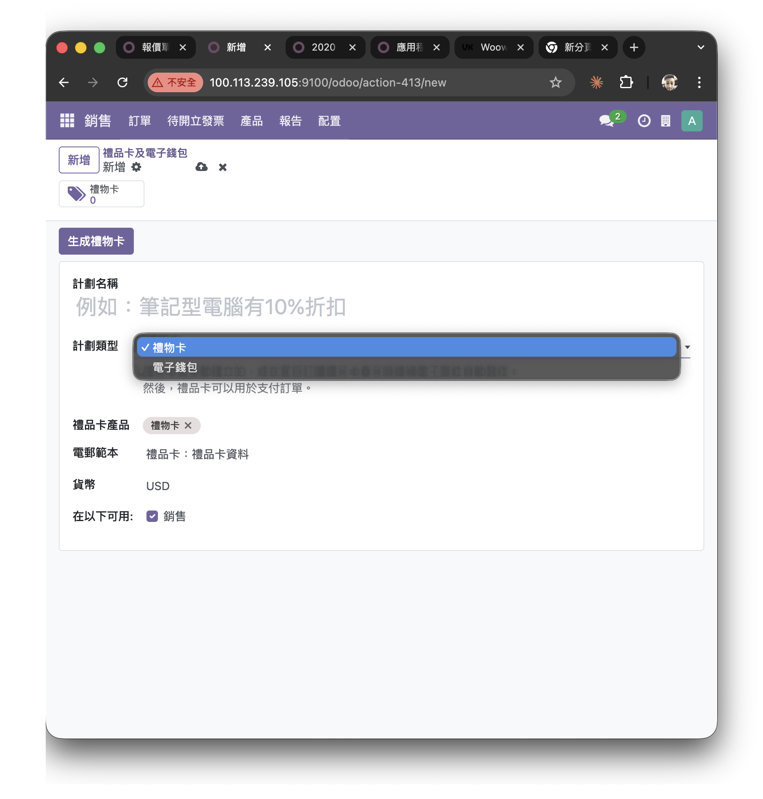<br>
  <em>禮品卡／電子錢包計劃類型下拉選單（對照參考）</em>
</p>

### 入口 / 會員中心

<p align="center">
  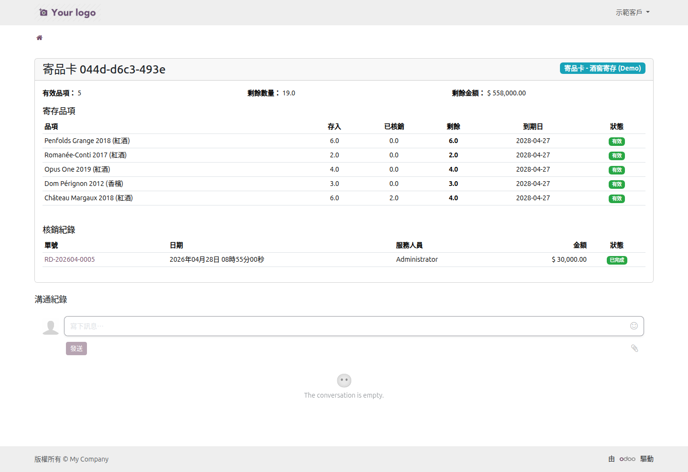<br>
  <em>顧客入口——寄品卡詳情，含品項清單與核銷紀錄</em>
</p>

<p align="center">
  <br>
  <em>會員中心總覽（手機版）——一覽所有卡種</em>
</p>

<p align="center">
  <br>
  <em>入口首頁（手機版）含會員中心入口</em>
</p>

<p align="center">
  <br>
  <em>會員中心——電子錢包餘額明細</em>
</p>

<p align="center">
  <br>
  <em>會員中心——集點卡點數明細</em>
</p>

<p align="center">
  <br>
  <em>會員中心——會員資格狀態</em>
</p>

---

## 安裝

1. 將本倉庫 clone 至您的 Odoo addons 目錄：
   ```bash
   cd /path/to/odoo/addons
   git clone https://github.com/WOOWTECH/Woow_odoo_loyalty_card_enhance.git
   ```

2. 在 Odoo 設定檔中加入倉庫路徑：
   ```ini
   [options]
   addons_path = /path/to/odoo/addons,/path/to/Woow_odoo_loyalty_card_enhance
   ```

3. 重啟 Odoo 並更新模組清單：
   ```bash
   odoo -u base --stop-after-init
   ```

4. 從 Odoo 應用程式選單安裝模組：
   - 搜尋 **「寄品卡」** 或 **「Consignment Card」** → 安裝 `woow_loyalty_consign`
   - 搜尋 **「會員中心」** 或 **「Member Center」** → 安裝 `woow_member_center`

### 系統需求

| 需求 | 版本 |
|------|------|
| Odoo | 18.0（社區版或企業版） |
| Python | 3.12+ |
| 必要 Odoo 模組 | `loyalty`, `sale_loyalty`, `pos_loyalty`, `stock`, `portal`, `mail`, `membership` |

---

## 設定

### 1. 建立寄品計劃

1. 前往 **銷售 → 產品 → 忠誠卡與禮品卡**
2. 點擊 **新增**，選擇計劃類型 **寄品卡 (Consignment Card)**
3. 在 **觸發商品** 頁籤中，加入販售時應產生寄品卡的商品
4. 依需求設定電子郵件範本及卡片有效期

### 2. POS 設定

1. POS 條碼規則（前綴 `044`）已自動設定
2. 確認 **寄品核銷商品**（自動建立的資料記錄）已在您的 POS 商品清單中
3. POS 使用者需具備 **銷售點 / 使用者** 群組（存取控制已預先設定）

### 3. 入口網站存取

- 入口使用者在 **我的帳戶 → 寄品卡** 下自動看到其寄品卡
- 安裝 `woow_member_center` 以獲得統一會員中心入口

---

## 使用方式

### 建立寄品計劃

1. 前往 **銷售 → 產品 → 忠誠卡與禮品卡**
2. 建立新計劃，類型選擇 **寄品卡**
3. 加入觸發商品（例如「紅酒整箱——6 瓶裝」）

### 銷售訂單 → 自動建卡

1. 建立包含觸發商品的銷售訂單
2. 確認銷售訂單
3. 系統自動建立寄品卡，含個別品項明細
4. 顧客收到含卡片資訊的通知郵件

### POS 條碼核銷

1. 在 POS 掃描顧客的寄品卡條碼
2. 彈窗顯示可用品項及剩餘數量
3. 選擇要核銷的品項與數量
4. 確認——$0 核銷行加入訂單
5. 完成付款——核銷紀錄寫入後台

### 顧客入口

1. 顧客登入 Odoo 入口網站
2. 前往 **我的帳戶 → 寄品卡**（或 **會員中心**）
3. 查看卡片餘額、品項清單及核銷紀錄

---

## 技術細節

### 模組相依圖

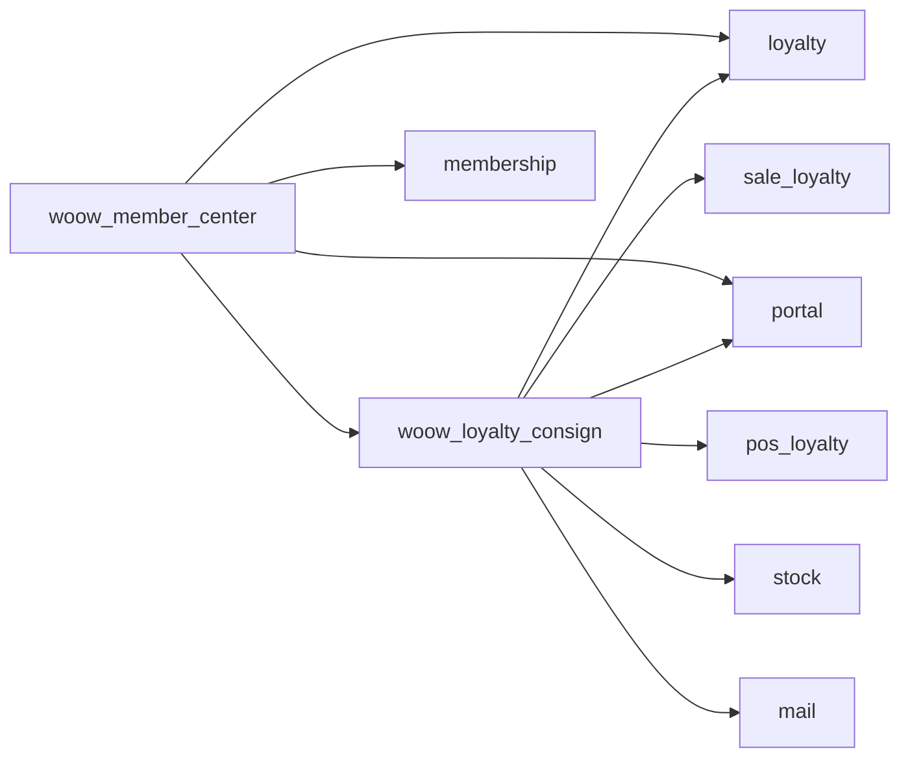

### 檔案結構

```
Woow_odoo_loyalty_card_enhance/
├── woow_loyalty_consign/
│   ├── __manifest__.py
│   ├── __init__.py
│   ├── models/
│   │   ├── loyalty_program.py          # 寄品計劃類型
│   │   ├── loyalty_card.py             # 卡片擴充
│   │   ├── loyalty_consign_line.py     # 逐品項追蹤
│   │   ├── loyalty_consign_redemption.py  # 核銷文件
│   │   ├── sale_order.py               # 自動建卡
│   │   ├── pos_config.py              # POS 條碼 RPC
│   │   ├── pos_order.py              # POS 核銷確認
│   │   └── pos_order_line.py         # POS 行擴充
│   ├── wizard/
│   │   └── consign_redeem_wizard.py   # 後台核銷精靈
│   ├── controllers/
│   │   └── portal.py                 # 顧客入口控制器
│   ├── views/                        # XML 視圖、選單、入口範本
│   ├── security/                     # 存取控制與紀錄規則
│   ├── data/                         # 序號、郵件範本、商品
│   ├── report/                       # PDF 報表範本
│   └── static/src/                   # POS OWL 元件 (JS/XML)
│       └── overrides/
│           ├── components/
│           │   ├── product_screen/    # 條碼掃描處理
│           │   ├── payment_screen/    # 付款後勾點
│           │   └── consign_card_popup/ # 品項選擇彈窗
│           └── models/
│               └── pos_order.js       # 訂單同步擴充
├── woow_member_center/
│   ├── __manifest__.py
│   ├── models/
│   ├── controllers/
│   ├── views/                        # 入口樞紐範本
│   ├── security/
│   └── static/src/css/              # 響應式樣式
├── docs/
│   ├── images/                       # 畫面截圖
│   └── ARCHITECTURE.md               # 詳細架構文件
├── README.md                         # 英文文件
├── README_zh-TW.md                   # 繁體中文文件
├── LICENSE                           # LGPL-3
└── CHANGELOG.md                      # 版本紀錄
```

### 安全與存取控制

| 模型 | 業務員 | 經理 | POS 使用者 | 入口使用者 |
|------|--------|------|-----------|-----------|
| `loyalty.consign.line` | 讀寫建（不可刪） | 完整 CRUD | 僅讀取 | 僅讀取 |
| `loyalty.consign.redemption` | 讀寫建（不可刪） | 完整 CRUD | 讀取 + 建立 | 僅讀取 |
| `loyalty.consign.redemption.line` | 讀寫建（不可刪） | 完整 CRUD | 讀取 + 建立 | 僅讀取 |
| `loyalty.card` | （繼承） | （繼承） | （繼承） | 僅讀取 |

入口使用者僅能查看自己的紀錄（透過 `ir.rule` 列層級安全控管）。

---

## 開發藍圖

- [ ] 批次核銷——單筆 POS 交易中從多張卡片核銷
- [ ] 到期管理——品項即將到期時自動通知
- [ ] 轉讓——允許顧客將寄存品項轉讓給其他會員
- [ ] 庫存整合——將寄品明細連結倉庫庫存異動
- [ ] 分析儀表板——核銷趨勢、熱門品項、卡片使用率

---

## 貢獻

歡迎貢獻！請依以下步驟：

1. Fork 本倉庫
2. 建立功能分支（`git checkout -b feature/my-feature`）
3. 提交變更（`git commit -m 'feat: add my feature'`）
4. 推送分支（`git push origin feature/my-feature`）
5. 建立 Pull Request

請確保您的程式碼遵循 [Odoo 開發指南](https://www.odoo.com/documentation/18.0/contributing/development/coding_guidelines.html)。

---

## 授權

本專案採用 **GNU 較寬鬆通用公共授權 v3.0 (LGPL-3)** 授權——詳見 [LICENSE](LICENSE) 檔案。

---

## 作者

<p align="center">
  <b>WoowTech 沃科技</b><br>
  <a href="https://www.woow.tw">https://www.woow.tw</a><br>
  Odoo 整合專家——ERP、忠誠度、POS 與電子商務解決方案
</p>
